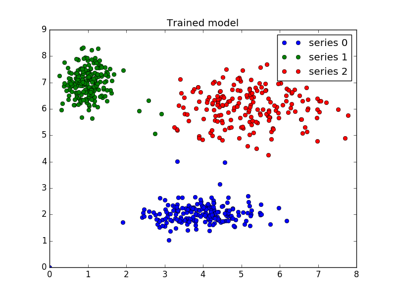

# hybrid.py

This is my self-driven research project aimed to find accurate fuzzy clustering of very large data.
Fuzzy C-means clustering or FCM is a clustering technique in which an instance of data or  a data point is clustered in one or more classes.It identifies the clusters on the basis of similarity among data points or partition matrix. It is an unsupervised learning algorithm. However, It runs a  disadvantage of converging at local optimum.

The Following approaches have been applied for hybridising FCM:

* **Particle Swarm Optimization**:
PSO is a  natural computing algorithm which derives its motivation from a flock of swarm travelling in search of food. In PSO,there is  a swarm of particles continuously moving in search space, each particle posseses a possible solution for the problem and travels until optimum is reached. In it, a particle has two properties – its position and velocity and it tends to move towards its personal best position and the global best position. PSO has been credited  to give better results in case of multilabel classification problems i.e problems with more than two classes. New variants of PSO are also being introduced to give optimized performance.

* **Ant Colony Optimization**:
ACO is a natural computing algorithm which is based on ant system in which an ant tracks down the way to food by the amount of pheroemones deposited on the path by other ants.While the ants are travelling in search of food, they deposit some amount of pheromones on their path and later the other ants follow the path depending upon the amount of pheromones on each path. The major advantage of ACO is that it is convergent that is convergence if guananteed whenever the algorithm is run but the number of iterations is not fixed. It is used for high-computational problems and has its applications in Image Processing, Vehicle routing, Scheduling Problem, travelling salesman problem and network routing, etc.

* **Gravitational Search Algorithm**:
GSA is a nature inspired algorithm based on the Newton’s famous law of gravity and the law of motion. GSA is classified under population-based method and is reported to be more instinctive. In GSA, the agent has four parameters which are position, inertial mass, active gravitational mass, and passive gravitational mass.

## Description

I the src folder, there are python modules.
**aco.py**: Contains the FCM code optimised by ACO
**pso.py**: Contains the FCM code optimised by PSO
**sa.py**: Contains the FCM code optimised by GSA
**util.py**: Contains all the utility functions and libraries
